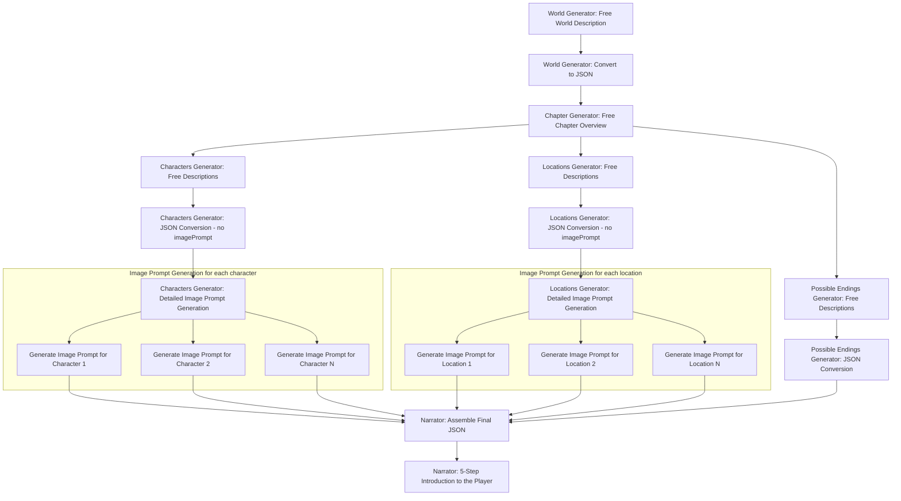

# World and Chapter Generation Module Documentation

This module constructs an imaginative world and details specific chapters using the Hero's Journey framework. The process combines free-form natural language generation with structured JSON output.

## 1. Overview

- **Purpose:**  
  - **World Generation:** Create a free description of the overall world and transform it into JSON.
  - **Chapter Generation:** Detail each chapter using the Hero's Journey with characters, locations, and possible endings.

- **Execution:**  
  Independent prompts can be executed in parallel.

## 2. User Input

The generation process begins with user input in the following JSON format:

```json
{
  "world": {
    "theme": "string",
    "genre": "string",
    "year": 2150,
    "setting": "string"
  },
  "playerCharacter": {
    "name": "string",
    "age": 20,
    "appearance": "string",
    "background": "string"
  }
}
```

This input provides essential constraints while allowing the generator freedom to create rich details about the world and narrative elements.

## 2. Module Responsibilities & Flow

### World Generator
1. Generate high-level free text overview of the world (settings, ambience, rules)
2. Transform into JSON structure:
   ```json
   {
     "world": {
       "description": "string",
       "rules": ["string"],
       "prolog": "string"
     }
   }
   ```

### Chapter Generator
1. Create a free overview for the current chapter using the Hero's Journey framework

2. **Characters Generation:**  
   - Generate rich, free descriptions for each character
   - Convert to JSON (excluding the `imagePrompt`):
     ```json
     {
       "characters": [
         {
           "id": "string",
           "name": "string",
           "role": "string",
           "description": "string",
           "personalityTraits": ["string"] | null,
           "backstory": "string",
           "goals": ["string"],
           "relationships": [{
             "id": "string",
             "level": 0,
             "type": "string",
             "backstory": "string"
           }],
           "connectedLocations": ["string"]
         }
       ]
     }
     ```
   - Independently generate detailed visual prompts for each character:
     ```json
     {
       "characters": [
         {
           "id": "string",
           "imagePrompt": "string"
         }
       ]
     }
     ```

3. **Locations Generation:**  
   - Create free descriptions for each location
   - Convert to JSON (without the `imagePrompt`):
     ```json
     {
       "locations": [
         {
           "id": "string",
           "name": "string",
           "description": "string",
           "connectedLocations": ["string"],
           "connectedCharacters": ["string"],
           "rules": ["string"]
         }
       ]
     }
     ```
   - Generate separate image prompts for each location:
     ```json
     {
       "locations": [
         {
           "id": "string",
           "imagePrompt": "string"
         }
       ]
     }
     ```

4. **Possible Endings Generation:**  
   - Describe multiple potential endings related to chapter events
   - Format into JSON:
     ```json
     {
       "possibleEndings": [
         {
           "trigger": "string",
           "result": "string"
         }
       ]
     }
     ```

5. **Narrator Processing:**  
   - Pass the final merged JSON to the narrator
   - Narrator selects key information and introduces the story to the player in 5 short steps

## 3. Flow Diagram



## 4. Final Output

The final aggregated JSON sent to the Narrator contains:

```json
{
  "world": { ... },
  "characters": [ ... ],
  "locations": [ ... ],
  "possibleEndings": [ ... ]
}
```

## 5. Design Considerations

- **Parallel Execution:** Non-dependent steps should be executed concurrently.
- **Error Handling:** Validate each JSON output against defined schemas.
- **Extensibility:** Accommodate future changes without major rework.
- **Separation of Concerns:** Each generator handles its own free-form description and JSON conversion.
