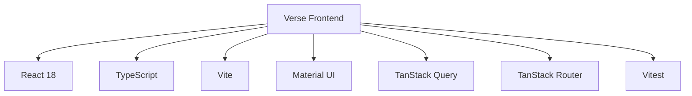

# Verse Frontend

An AI-driven, text-based adventure game focused on building relationships with AI characters through dynamic narratives and meaningful choices.

## Table of Contents

- [Overview](#overview)
- [Tech Stack](#tech-stack)
- [Prerequisites](#prerequisites)
- [Installation](#installation)
- [Development](#development)
- [Project Structure](#project-structure)
- [Testing](#testing)
- [Configuration](#configuration)
- [Docker](#docker)
- [Contributing](#contributing)

## Overview

Verse is an interactive storytelling platform where players can engage with AI-driven characters in rich, narrative experiences. The frontend application provides the user interface for these interactions, handling game state, user choices, and narrative progression.

## Tech Stack



- **React 18**: Core UI library
- **TypeScript**: Type-safe JavaScript
- **Vite**: Fast build tool and dev server
- **Material UI**: Component library for consistent design
- **TanStack Query**: Data fetching and state management
- **TanStack Router**: Type-safe routing solution
- **Vitest + Testing Library**: Testing framework

## Prerequisites

- Node.js (v18+)
- npm or yarn
- Backend API (configured via environment variables)

## Installation

1. Clone the repository:
   ```bash
   git clone git@github.com:inzynierka-ai/verse-monorepo.git
   cd verse/apps/frontend
   ```

2. Install dependencies:
   ```bash
   yarn install
   ```

3. Configure environment:
   ```bash
   cp .env.example .env
   ```

4. Update the `.env` file with your specific configuration needs:

## Development

Start the development server with:

```bash
yarn dev
```

This will launch the application on [http://localhost:5173](http://localhost:5173)

### Available Scripts

| Command | Description |
| ------- | ----------- |
| `yarn dev` | Start the development server |
| `yarn build` | Build for production |
| `yarn preview` | Preview production build |
| `yarn lint` | Run ESLint |
| `yarn test` | Run tests |
| `yarn test:watch` | Run tests in watch mode |
| `yarn coverage` | Generate test coverage report |

## Project Structure

```
src/
├── common/     # Shared components, hooks, and utilities
├── pages/      # Page components organized by route
├── services/   # API services and external integrations
├── types/      # TypeScript type definitions
├── utils/      # Utility functions
├── main.tsx    # Application entry point
├── router.tsx  # Application routing configuration
```

## Testing

We use Vitest and React Testing Library for testing. Run the test suite with:

```bash
yarn test
```

Generate coverage reports with:

```bash
yarn coverage
```

## Docker

### Building and Running

Build and run the container with:

```bash
docker build -t verse-frontend .
docker run -p 5173:5173 verse-frontend
```

Or use Docker Compose:

```bash
docker compose up --build
```
