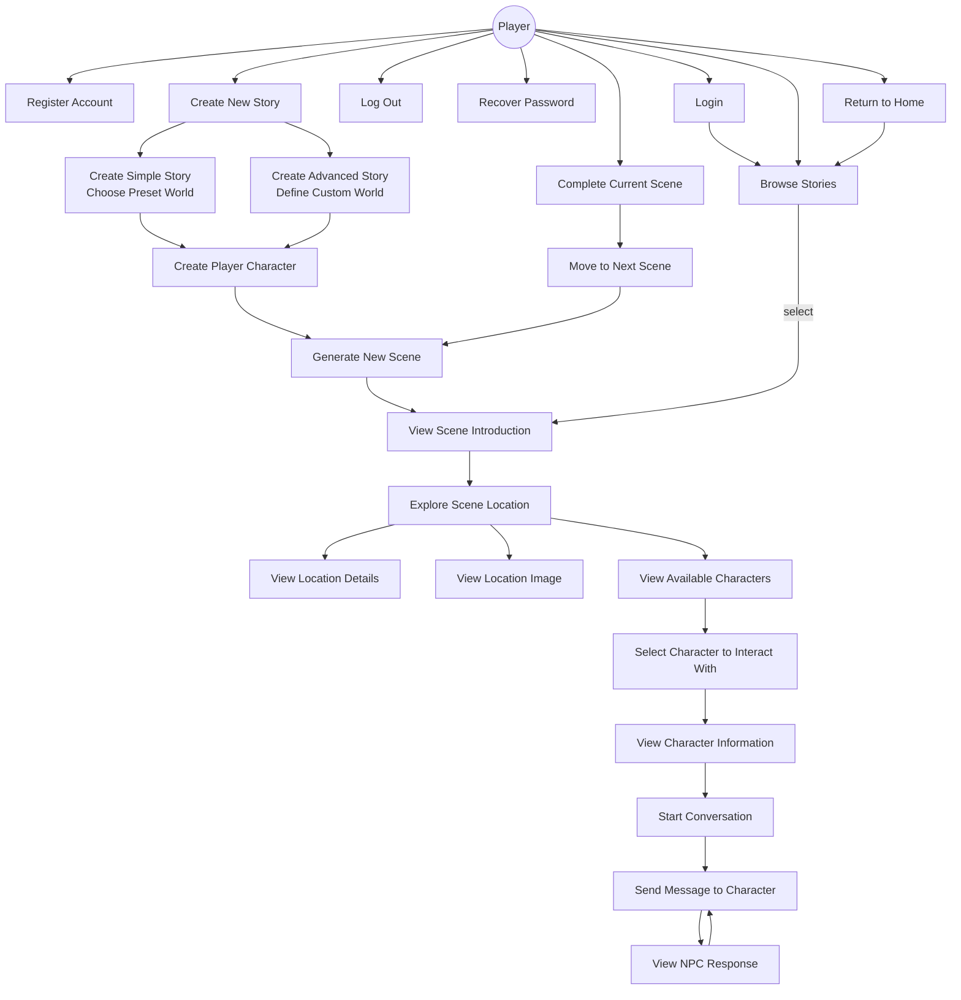

```mermaid
graph TD
    Player((Player))

    %% Authentication Flow
    Register[Register Account]
    Login[Login]
    LogOut[Log Out]
    ForgotPassword[Recover Password]
    
    %% Story Management
    ViewStories[Browse Stories]
    CreateStory[Create New Story]
    
    %% Story Creation Options
    SimpleStory[Create Simple Story<br/>Choose Preset World]
    AdvancedStory[Create Advanced Story<br/>Define Custom World]
    
    %% Character Creation
    CreatePlayerCharacter[Create Player Character]
    
    %% Scene System Flow
    SceneGeneration[Generate New Scene]
    ViewSceneIntro[View Scene Introduction]
    
    %% Location Interaction
    ExploreLocation[Explore Scene Location]
    ViewLocationDetails[View Location Details]
    ViewLocationImage[View Location Image]
    
    %% Character Interaction
    ViewSceneCharacters[View Available Characters]
    SelectCharacter[Select Character to Interact With]
    ViewCharacterInfo[View Character Information]
    
    
    %% Conversation Flow
    StartConversation[Start Conversation]
    SendMessage[Send Message to Character]
    ViewNPCResponse[View NPC Response]
    
    %% Scene Navigation
    CompleteScene[Complete Current Scene]
    MoveToNextScene[Move to Next Scene]
    NavigateHome[Return to Home]
    
    %% Core Authentication Links
    Player --> Register
    Player --> Login
    Login --> ViewStories
    Player --> LogOut
    Player --> ForgotPassword
    
    %% Story Creation Flow
    Player --> ViewStories
    Player --> CreateStory
    CreateStory --> SimpleStory
    CreateStory --> AdvancedStory
    
    %% Initialize Story Flow
    SimpleStory --> CreatePlayerCharacter
    AdvancedStory --> CreatePlayerCharacter
    CreatePlayerCharacter --> SceneGeneration
    
    %% Scene Exploration Flow
    SceneGeneration --> ViewSceneIntro
    ViewSceneIntro --> ExploreLocation
    ExploreLocation --> ViewLocationDetails
    ExploreLocation --> ViewLocationImage
    ExploreLocation --> ViewSceneCharacters
    
    %% Character Interaction Flow
    ViewSceneCharacters --> SelectCharacter
    SelectCharacter --> ViewCharacterInfo
    
    ViewCharacterInfo --> StartConversation
    
    %% Conversation Flow
    StartConversation --> SendMessage
    SendMessage --> ViewNPCResponse
    ViewNPCResponse --> SendMessage
    
    %% Scene Completion Flow
    Player --> CompleteScene
    CompleteScene --> MoveToNextScene
    MoveToNextScene --> SceneGeneration
    Player --> NavigateHome
    
    %% Story Selection
    ViewStories -- select --> ViewSceneIntro
    NavigateHome --> ViewStories
``` 