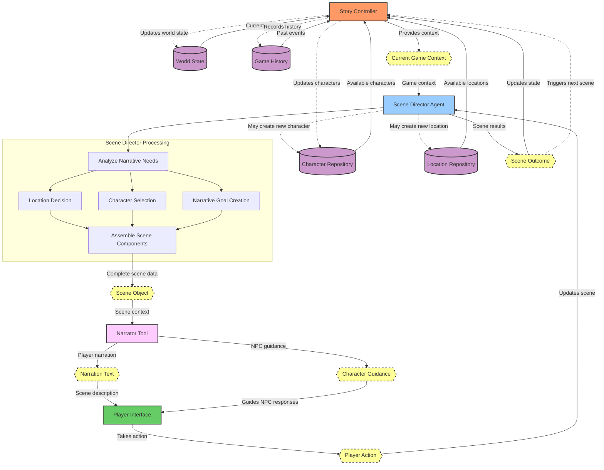

# Verse Game System Requirements - First Scene Implementation

## Overview
Implementation of the initial scene generation system to create a working interface for player-character interactions in the Verse game.

## Focus Areas

### 1. Minimal Story Controller

#### Requirements
- Implement basic state management for a single scene
- Create initial world context setup functionality
- Build simple player character state tracking

#### Acceptance Criteria
- Controller provides adequate context for Scene Director to generate first scene
- Tracks basic character relationships in-memory for duration of scene
- Maintains simple world facts during scene interaction

### 2. Scene Director Agent

#### Requirements
- Implement core agent architecture with basic decision-making
- Create essential tools for character selection and scene setting
- Build reasoning system for initial scene construction
- Develop scene assembly for first playable scenario

#### Acceptance Criteria
- Agent selects appropriate characters for initial scene
- Sets up coherent location for first player interaction
- Creates meaningful goals for the opening scenario
- Assembles complete scene with all needed components
- Responds appropriately to player actions within scene

### 3. Narrator Tool

#### Requirements
- Create text generation for scene descriptions
- Implement basic NPC dialogue guidance
- Build player action response handling

#### Acceptance Criteria
- Generates engaging opening scene descriptions
- Creates natural-sounding NPC dialogue responses
- Produces appropriate contextual replies to player actions
- Maintains consistent tone and character personalities

### 4. Scene Interface

#### Requirements
- Implement player interaction flow for single scene
- Create simple UI for displaying scene narration and character dialogue
- Build input mechanism for player actions

#### Acceptance Criteria
- Player can see scene descriptions clearly
- Character dialogue is properly attributed and formatted
- Player can input actions that affect the scene
- System responds appropriately to player choices

## Technical Requirements

- **Performance**: Initial scene generation completes in under 5 seconds
- **Error Handling**: System recovers gracefully from generation failures
- **Testing**: Scene generation produces consistent, playable results

## Implementation Phases

1. **Phase 1**: Scene Director with basic character/location selection
2. **Phase 2**: Narrator tool for text generation
3. **Phase 3**: Player interface for scene interaction
4. **Phase 4**: Testing and refinement of single scene experience

## Definition of Done

- Player can engage with a complete, coherent opening scene
- NPCs respond appropriately to player choices
- Scene maintains internal consistency throughout interaction
- System successfully handles a variety of player inputs
- The experience is engaging and demonstrates the core game concept

# Summary: Story Controller & Scene Director Architecture

## Story Controller
- **Primary Role**: Maintains world state and game history
- **Responsibilities**:
  - Tracks hero's journey progression
  - Manages global state (world facts, relationships, past events)
  - Records scene outcomes
  - Provides context for scene generation
- **Data Management**:
  - Stores character and location repositories
  - Maintains player character state
  - Tracks narrative progression points
  - Records important memories and events

## Scene Director (Agent)
- **Primary Role**: Generates individual scenes using an agentic approach
- **Key Features**:
  - Operates with a set of tools to make autonomous decisions
  - Focuses on generating one scene at a time (no pre-planning)
  - Uses current state to inform scene creation
- **Tool Suite**:
  - Character tools: select/create/modify characters
  - Location tools: select/create/modify locations
  - Narrative tools: generate goals, retrieve memories
  - State management tools: update world state and relationships
  - Narrator tool: generate narration and NPC guidance

## Narrator (as Scene Director Tool)
- **Dual Functions**:
  - Player-facing: scene descriptions, transitions, action narration
  - NPC-facing: conversation suggestions, context, emotional responses
- **Implementation**: Specialized tool that converts scene structure into natural language

## Scene Generation Flow
1. Story Controller provides current state to Scene Director
2. Scene Director reasons about narrative needs
3. Scene Director uses tools to assemble scene components
4. Narrator tool creates descriptions and NPC guidance
5. Scene is presented to player for interaction
6. Outcomes are recorded by Story Controller
7. Process repeats for next scene

## Data Model Highlights
- Scenes contain location, characters, narrative goal
- Characters have personality traits, goals, and relationships
- Locations provide setting context
- Scene outcomes capture resolutions and new tensions

This architecture maintains narrative coherence while focusing on one scene at a time, using an agent-based approach for flexible and contextual scene generation.

This diagram shows:

1. **Data Flow Initiation**: Story Controller aggregates data from all repositories to create context
2. **Scene Director Processing**: 
   - Receives context and analyzes narrative needs
   - Makes decisions about location, characters, and goals
   - Assembles complete scene object
3. **Narrator Tool**: Transforms structured scene data into natural language and NPC guidance
4. **Player Interaction**: Receives narration and interacts with the scene 
5. **Outcome Processing**: Results update world state and history, then trigger the next scene cycle

The dotted lines represent conditional flows (like creating new characters/locations when needed) while solid lines show the primary data flow path.
